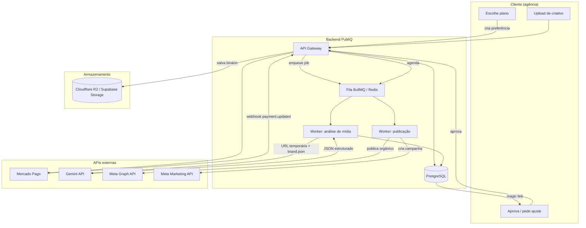

# PubliQ — PRD & System Design

**Versão:** 1.0 · **Status:** Rascunho para validação técnica · **Autor:** Produto & Engenharia

---

## 1. Visão do Produto

**Conceito:** Hub de Automação Visual-para-Publicação (SaaS B2B).

**Problema:** agências de marketing e freelancers de tráfego perdem horas por semana em um relay manual — o designer entrega a arte, o copywriter escreve a legenda, o gestor de tráfego sobe o anúncio e o social media agenda a postagem. Cada handoff é um ponto de atraso e de erro.

**Solução:** uma esteira ponta a ponta ("Drop & Publish"). O usuário sobe apenas o arquivo de mídia. A IA analisa a mídia visualmente, lê textos gráficos via OCR, consulta o perfil de tom de voz da marca e gera a copy pronta — orgânica e para anúncios — liberando aprovação rápida do cliente e disparo automático.

**Moat:** análise multimodal unificada (compreensão real do criativo, não apenas geração de texto cego), portal colaborativo de aprovação com o cliente final da agência, e publicação orgânica + tráfego pago numa única tela.

---

## 2. Arquitetura do Sistema

### 2.1 Fluxo de dados (visão textual)

**Ciclo de faturamento**
1. Usuário escolhe um plano → backend cria uma preferência no Mercado Pago com `external_reference = workspaceId`.
2. Usuário paga (Pix, cartão ou boleto) na página hospedada pelo Mercado Pago.
3. Mercado Pago envia webhook `payment.updated` → backend valida a assinatura HMAC, busca o pagamento pela API, e atualiza `Subscription` e `PaymentTransaction` dentro de uma transação idempotente.

**Ciclo "Drop & Publish"**
1. Cliente arrasta a mídia (PNG/JPG/MP4) → backend grava metadados (`MediaUpload`) e envia o binário ao storage (R2/Supabase) via upload assinado.
2. Backend enfileira um job (`BullMQ`/Redis) de análise.
3. Worker chama a Gemini API com a URL temporária da mídia + o JSON de perfil da marca.
4. Gemini retorna JSON estruturado (análise visual, copy orgânica, variações de ads) → worker grava em `Generation` e gera um `approvalToken` (magic link).
5. Cliente final abre o magic link, aprova ou pede ajustes — sem precisar de login.
6. Ao aprovar, o backend cria um `Schedule` e enfileira a publicação.
7. Worker de publicação chama a Meta Graph API (orgânico) e, se `Criar Anúncio` foi marcado, a Meta Marketing API (tráfego pago, cobrando diretamente da conta de anúncios do cliente da agência).

### 2.2 Diagrama de componentes



### 2.3 Componentes

| Componente | Responsabilidade |
|---|---|
| API Gateway (Node.js) | Autenticação, rotas enxutas, delega regra de negócio a services |
| PostgreSQL | Fonte de verdade multi-tenant (workspace → marcas → mídias) |
| Redis + BullMQ | Filas de análise e publicação, retry com backoff |
| Cloudflare R2 / Supabase Storage | Binários de mídia, URLs temporárias assinadas |
| Gemini API | Visão computacional multimodal + geração de copy |
| Meta Graph API | Publicação orgânica (feed, reels, stories) |
| Meta Marketing API | Criação programática de campanhas/anúncios |
| Mercado Pago API | Checkout, assinaturas recorrentes, webhooks de pagamento |

---

## 3. Principais Fluxos de Usuário

1. **Assinatura e onboarding** — plano escolhido → preferência Mercado Pago → pagamento → webhook → ativação da `Subscription`.
2. **Cadastro da marca & brand voice** — persona, nicho, proposta de valor, palavras proibidas, tom de voz, OAuth com a Meta.
3. **Esteira Drop & Publish** — upload → processamento assíncrono → copy orgânica + ads → portal de aprovação (magic link) → agendamento/disparo.
4. **Subida de tráfego pago** — ao aprovar, opção "Criar Anúncio" consome a Meta Marketing API com o token da própria conta de anúncios do cliente da agência (risco financeiro zero para o SaaS).

---

## 4. Modelo de Negócio

| Plano | Preço | Marcas | Criativos/mês | Ads | Portal white-label |
|---|---|---|---|---|---|
| Starter | ~R$ 97/mês | até 3 | 30 | — | — |
| Pro | ~R$ 247/mês | até 10 | 120 | ✓ | — |
| Agency | R$ 497–790/mês | até 30 | 500+ | ✓ | ✓ |

---

## 5. Integração Mercado Pago

### 5.1 Criação da preferência de checkout

```typescript
import { MercadoPagoConfig, Preference } from "mercadopago";

const client = new MercadoPagoConfig({ accessToken: process.env.MP_ACCESS_TOKEN! });

interface CreateSubscriptionPreferenceInput {
  workspaceId: string;
  planId: "starter" | "pro" | "agency";
  planName: string;
  planPriceCents: number;
  payerEmail: string;
}

export async function createSubscriptionPreference(
  input: CreateSubscriptionPreferenceInput,
) {
  const preference = new Preference(client);

  const response = await preference.create({
    body: {
      items: [
        {
          id: input.planId,
          title: `PubliQ — Plano ${input.planName}`,
          quantity: 1,
          unit_price: input.planPriceCents / 100,
          currency_id: "BRL",
        },
      ],
      payer: { email: input.payerEmail },
      back_urls: {
        success: `${process.env.APP_URL}/checkout/sucesso`,
        failure: `${process.env.APP_URL}/checkout/falha`,
        pending: `${process.env.APP_URL}/checkout/pendente`,
      },
      auto_return: "approved",
      external_reference: input.workspaceId,
      notification_url: `${process.env.API_URL}/webhooks/mercadopago`,
      metadata: {
        workspace_id: input.workspaceId,
        plan_id: input.planId,
      },
      statement_descriptor: "PUBLIQ",
    },
  });

  return { checkoutUrl: response.init_point, preferenceId: response.id };
}
```

> Assinaturas recorrentes de cartão devem usar a **Preapproval API** (`/preapproval_plan` + `/preapproval`); a preferência acima cobre o checkout avulso via Pix/boleto/cartão e o link de renovação manual.

### 5.2 Webhook com validação de assinatura e idempotência

```typescript
import { createHmac, timingSafeEqual } from "node:crypto";
import type { Request, Response } from "express";
import { prisma } from "../lib/prisma";
import { fetchPayment } from "../services/mercadopago.service";

function isValidSignature(req: Request): boolean {
  const signatureHeader = req.header("x-signature");
  const requestId = req.header("x-request-id");
  const dataId = req.query["data.id"];

  if (!signatureHeader || !requestId || !dataId) return false;

  const parts = Object.fromEntries(
    signatureHeader.split(",").map((pair) => pair.trim().split("=") as [string, string]),
  );
  const { ts, v1 } = parts;
  if (!ts || !v1) return false;

  const normalizedDataId = /^[0-9]+$/.test(String(dataId))
    ? String(dataId)
    : String(dataId).toLowerCase();

  const manifest = `id:${normalizedDataId};request-id:${requestId};ts:${ts};`;
  const expected = createHmac("sha256", process.env.MP_WEBHOOK_SECRET!)
    .update(manifest)
    .digest("hex");

  const expectedBuf = Buffer.from(expected);
  const receivedBuf = Buffer.from(v1);
  return (
    expectedBuf.length === receivedBuf.length && timingSafeEqual(expectedBuf, receivedBuf)
  );
}

export async function handleMercadoPagoWebhook(req: Request, res: Response) {
  if (!isValidSignature(req)) {
    return res.status(401).json({ error: "assinatura inválida" });
  }

  const { type, data } = req.body as { type: string; data: { id: string } };
  if (type !== "payment") {
    return res.status(200).send("ignorado");
  }

  const alreadyProcessed = await prisma.webhookEvent.findUnique({
    where: { provider_externalEventId: { provider: "mercadopago", externalEventId: data.id } },
  });
  if (alreadyProcessed) {
    return res.status(200).send("já processado");
  }

  const payment = await fetchPayment(data.id);

  await prisma.$transaction(async (tx) => {
    await tx.webhookEvent.create({
      data: { provider: "mercadopago", externalEventId: data.id, payload: payment },
    });

    const subscription = await tx.subscription.findUnique({
      where: { workspaceId: payment.external_reference },
    });
    if (!subscription) throw new Error("assinatura não encontrada para o workspace");

    await tx.paymentTransaction.upsert({
      where: { mpPaymentId: payment.id.toString() },
      create: {
        subscriptionId: subscription.id,
        mpPaymentId: payment.id.toString(),
        status: payment.status,
        method: payment.payment_type_id,
        amountCents: Math.round(payment.transaction_amount * 100),
        rawPayload: payment,
      },
      update: { status: payment.status, rawPayload: payment },
    });

    if (payment.status === "approved") {
      await tx.subscription.update({
        where: { id: subscription.id },
        data: { status: "active", currentPeriodEnd: addDays(new Date(), 30) },
      });
    }
  });

  return res.status(200).send("ok");
}
```

---

## 6. System Prompt da Gemini API

### 6.1 Instrução de sistema

```
Você é o motor de análise criativa do PubliQ, uma plataforma de automação de
conteúdo para agências de marketing. Sua função é observar uma peça
publicitária (imagem estática ou vídeo) com o olhar de um estrategista de
mídias sociais sênior e retornar uma análise estruturada, sem nunca
conversar ou explicar seu raciocínio fora do JSON solicitado.

Você receberá:
1. A mídia (imagem ou frames de vídeo) anexada nesta mensagem.
2. Um objeto JSON com o perfil da marca (brand_profile): nicho, proposta de
   valor, tom de voz, palavras proibidas e público-alvo.

Regras obrigatórias:
- Leia todo texto visível na peça (placas, legendas embutidas, preços,
  letreiros) e transcreva-o em visual_analysis.ocr_text. Se não houver
  texto, retorne uma string vazia.
- Identifique produtos, cenário, pessoas, cores dominantes e o gatilho
  emocional central da peça.
- Escreva toda copy no tom de voz definido em brand_profile.tone_of_voice.
  Nunca use uma palavra presente em brand_profile.forbidden_words.
- Gere a legenda orgânica em português do Brasil, com gancho nas duas
  primeiras linhas (antes do "ver mais"), corpo persuasivo e um CTA claro.
- Gere exatamente 3 variações de copy para anúncios, cada uma com um ângulo
  de venda diferente: urgência, prova social e benefício direto.
- Preencha compliance.forbidden_words_found com qualquer palavra proibida
  que a peça sugira, mesmo que você a tenha evitado — isso alerta o gestor
  de tráfego.
- Se a mídia não tiver relação clara com o nicho da marca, gere o melhor
  conteúdo possível e reduza compliance.tone_alignment_score de acordo.
- Responda apenas com o JSON definido no schema. Não inclua markdown,
  comentários ou texto fora do objeto.
```

### 6.2 JSON Schema de resposta (`responseSchema`)

```json
{
  "type": "object",
  "properties": {
    "visual_analysis": {
      "type": "object",
      "properties": {
        "description": { "type": "string" },
        "detected_elements": { "type": "array", "items": { "type": "string" } },
        "ocr_text": { "type": "string" },
        "emotional_context": { "type": "string" },
        "dominant_colors": { "type": "array", "items": { "type": "string" } }
      },
      "required": ["description", "detected_elements", "ocr_text", "emotional_context"]
    },
    "organic_copy": {
      "type": "object",
      "properties": {
        "hook": { "type": "string" },
        "body": { "type": "string" },
        "cta": { "type": "string" },
        "hashtags": { "type": "array", "items": { "type": "string" } }
      },
      "required": ["hook", "body", "cta", "hashtags"]
    },
    "ads_copy_variations": {
      "type": "array",
      "minItems": 3,
      "maxItems": 3,
      "items": {
        "type": "object",
        "properties": {
          "angle": {
            "type": "string",
            "enum": ["urgencia", "prova_social", "beneficio_direto"]
          },
          "headline": { "type": "string" },
          "primary_text": { "type": "string" },
          "cta_type": {
            "type": "string",
            "enum": ["SAIBA_MAIS", "COMPRE_AGORA", "CADASTRE_SE", "ENVIAR_MENSAGEM"]
          }
        },
        "required": ["angle", "headline", "primary_text", "cta_type"]
      }
    },
    "compliance": {
      "type": "object",
      "properties": {
        "forbidden_words_found": { "type": "array", "items": { "type": "string" } },
        "tone_alignment_score": { "type": "number" }
      },
      "required": ["forbidden_words_found", "tone_alignment_score"]
    }
  },
  "required": ["visual_analysis", "organic_copy", "ads_copy_variations", "compliance"]
}
```

### 6.3 Chamada ao modelo

```typescript
import { GoogleGenerativeAI } from "@google/generative-ai";
import { CREATIVE_ANALYSIS_SCHEMA, CREATIVE_ANALYSIS_SYSTEM_PROMPT } from "./gemini.constants";
import type { BrandProfile, CreativeAnalysisResult } from "./gemini.types";

const genAI = new GoogleGenerativeAI(process.env.GEMINI_API_KEY!);

export async function analyzeCreative(
  mediaUri: string,
  mimeType: string,
  brandProfile: BrandProfile,
): Promise<CreativeAnalysisResult> {
  const model = genAI.getGenerativeModel({
    model: "gemini-1.5-pro",
    systemInstruction: CREATIVE_ANALYSIS_SYSTEM_PROMPT,
    generationConfig: {
      responseMimeType: "application/json",
      responseSchema: CREATIVE_ANALYSIS_SCHEMA,
      temperature: 0.6,
    },
  });

  const result = await model.generateContent([
    { fileData: { fileUri: mediaUri, mimeType } },
    { text: JSON.stringify({ brand_profile: brandProfile }) },
  ]);

  return JSON.parse(result.response.text()) as CreativeAnalysisResult;
}
```

---

## 7. Modelo de Dados (PostgreSQL / Prisma)

```prisma
generator client {
  provider = "prisma-client-js"
}

datasource db {
  provider = "postgresql"
  url      = env("DATABASE_URL")
}

enum SubscriptionStatus {
  trialing
  active
  past_due
  canceled
}

enum UploadStatus {
  pending
  processing
  ready
  failed
}

enum ApprovalStatus {
  pending_review
  changes_requested
  approved
}

enum ScheduleChannel {
  instagram_feed
  instagram_reel
  instagram_story
  facebook_page
}

enum ScheduleStatus {
  scheduled
  publishing
  published
  failed
}

enum AdCampaignStatus {
  draft
  active
  paused
  failed
}

enum WebhookProvider {
  mercadopago
  meta
}

model Workspace {
  id           String        @id @default(cuid())
  name         String
  ownerId      String
  owner        User          @relation(fields: [ownerId], references: [id])
  members      User[]        @relation("WorkspaceMembers")
  brands       Brand[]
  subscription Subscription?
  createdAt    DateTime      @default(now())

  @@map("workspaces")
}

model User {
  id              String      @id @default(cuid())
  email           String      @unique
  passwordHash    String?
  name            String
  ownedWorkspaces Workspace[]
  workspaceId     String?
  workspace       Workspace?  @relation("WorkspaceMembers", fields: [workspaceId], references: [id])
  createdAt       DateTime    @default(now())

  @@map("users")
}

model Plan {
  id               String         @id
  name             String
  priceCents       Int
  brandLimit       Int
  creativeLimit    Int
  allowsAds        Boolean        @default(false)
  allowsWhiteLabel Boolean        @default(false)
  subscriptions    Subscription[]

  @@map("plans")
}

model Subscription {
  id               String             @id @default(cuid())
  workspaceId      String             @unique
  workspace        Workspace          @relation(fields: [workspaceId], references: [id])
  planId           String
  plan             Plan               @relation(fields: [planId], references: [id])
  status           SubscriptionStatus @default(trialing)
  mpPreapprovalId  String?            @unique
  currentPeriodEnd DateTime?
  transactions     PaymentTransaction[]
  createdAt        DateTime           @default(now())
  updatedAt        DateTime           @updatedAt

  @@map("subscriptions")
}

model PaymentTransaction {
  id             String       @id @default(cuid())
  subscriptionId String
  subscription   Subscription @relation(fields: [subscriptionId], references: [id])
  mpPaymentId    String       @unique
  status         String
  method         String
  amountCents    Int
  rawPayload     Json
  createdAt      DateTime     @default(now())

  @@map("payment_transactions")
}

model Brand {
  id                    String        @id @default(cuid())
  workspaceId           String
  workspace             Workspace     @relation(fields: [workspaceId], references: [id])
  name                  String
  niche                 String
  valueProposition      String
  toneOfVoice           String
  forbiddenWords        String[]
  metaAccessTokenCipher String?
  metaPageId            String?
  metaAdAccountId       String?
  metaTokenExpiresAt    DateTime?
  mediaUploads          MediaUpload[]
  createdAt             DateTime      @default(now())

  @@map("brands")
}

model MediaUpload {
  id           String       @id @default(cuid())
  brandId      String
  brand        Brand        @relation(fields: [brandId], references: [id])
  uploadedById String
  storageKey   String
  storageUrl   String
  mimeType     String
  status       UploadStatus @default(pending)
  durationMs   Int?
  generation   Generation?
  createdAt    DateTime     @default(now())

  @@map("media_uploads")
}

model Generation {
  id                String            @id @default(cuid())
  mediaUploadId     String            @unique
  mediaUpload       MediaUpload       @relation(fields: [mediaUploadId], references: [id])
  visualAnalysis    Json
  organicCopy       Json
  adsCopyVariations Json
  approvalStatus    ApprovalStatus    @default(pending_review)
  approvalToken     String            @unique @default(cuid())
  clientFeedback    String?
  approvedAt        DateTime?
  schedule          Schedule?
  adCampaignConfig  AdCampaignConfig?
  createdAt         DateTime          @default(now())

  @@map("generations")
}

model Schedule {
  id             String          @id @default(cuid())
  generationId   String          @unique
  generation     Generation      @relation(fields: [generationId], references: [id])
  channel        ScheduleChannel
  scheduledAt    DateTime
  status         ScheduleStatus  @default(scheduled)
  externalPostId String?
  retryCount     Int             @default(0)
  lastError      String?

  @@map("schedules")
}

model AdCampaignConfig {
  id                 String            @id @default(cuid())
  generationId       String            @unique
  generation         Generation        @relation(fields: [generationId], references: [id])
  adAccountId        String
  objective          String
  dailyBudgetCents   Int
  status             AdCampaignStatus  @default(draft)
  externalCampaignId String?
  externalAdSetId    String?
  externalAdId       String?

  @@map("ad_campaign_configs")
}

model WebhookEvent {
  id              String          @id @default(cuid())
  provider        WebhookProvider
  externalEventId String
  payload         Json
  processedAt     DateTime        @default(now())

  @@unique([provider, externalEventId])
  @@map("webhook_events")
}
```

---

## 8. Tratamento de Falhas e Rate Limits

| Falha | Estratégia | Detalhe técnico |
|---|---|---|
| Token da Meta expira (~60 dias) | Renovação proativa + bloqueio gracioso | Job diário verifica `metaTokenExpiresAt`; a 7 dias do vencimento, notifica o admin do workspace; ao vencer, marca a marca como `needs_reauth` e bloqueia novos agendamentos até reconexão OAuth |
| Falha de upload (rede instável, arquivo grande) | Upload resumível + retry no cliente | URLs pré-assinadas com upload multipart; o cliente reenvia apenas as partes que falharam, com backoff exponencial (base 500ms, até 5 tentativas) |
| Job de análise (Gemini) falha ou recebe 429 | Retry com backoff exponencial + fallback de modelo | `attempts: 5`, `backoff: { type: 'exponential', delay: 2000 }`; após 4 erros 429 consecutivos, o worker alterna de `gemini-1.5-pro` para `gemini-1.5-flash` |
| Publicação falha na Meta Graph API | Fila de reprocessamento + alerta humano | `Schedule.status = failed` com `lastError` gravado; 3 novas tentativas com backoff; em seguida, notificação ao social media responsável |
| Rate limit da Meta Marketing API (Business Use Case) | Respeita cabeçalhos de uso + concorrência dinâmica | Lê `x-business-use-case-usage`; acima de 80% de uso, o worker reduz a concorrência da fila daquela conta de anúncios até a janela resetar |
| Webhook do Mercado Pago duplicado ou fora de ordem | Idempotência via `WebhookEvent` | Chave única `(provider, externalEventId)`; uma segunda entrega retorna 200 sem reprocessar |
| Jobs presos por crash do worker | Dead-letter queue + observabilidade | Jobs que esgotam as tentativas caem numa fila `failed-jobs` inspecionável, com alerta para o time de operação |

```typescript
await mediaAnalysisQueue.add(
  "analyze-creative",
  { mediaUploadId },
  {
    attempts: 5,
    backoff: { type: "exponential", delay: 2000 },
    removeOnComplete: 100,
    removeOnFail: false,
  },
);
```

```typescript
export async function assertBrandCanPublish(brand: Brand): Promise<void> {
  if (!brand.metaTokenExpiresAt) {
    throw new PublishBlockedError("marca sem conexão com a Meta");
  }

  const daysUntilExpiry = differenceInDays(brand.metaTokenExpiresAt, new Date());

  if (daysUntilExpiry <= 0) {
    await markBrandAsNeedsReauth(brand.id);
    throw new PublishBlockedError("token da Meta expirado — reconexão necessária");
  }

  if (daysUntilExpiry <= 7) {
    await notifyWorkspaceAdmin(brand.workspaceId, "meta_token_expiring_soon");
  }
}
```
